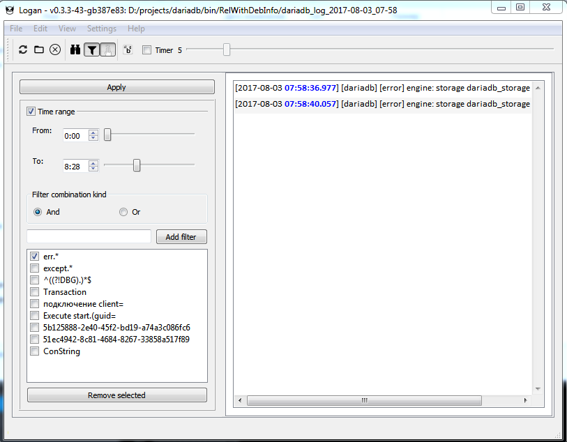

# LogAnalyzer

# Features
* Log viewing.
* Auto scrolling.
* Reload logs by timer.
* Highlight by regex.
* Filtration by regex.
* Filtration by time.

# Screenshots
Let's look at [dariadb](https://github.com/lysevi/dariadb) logs.
## Log view

## Log filtration

